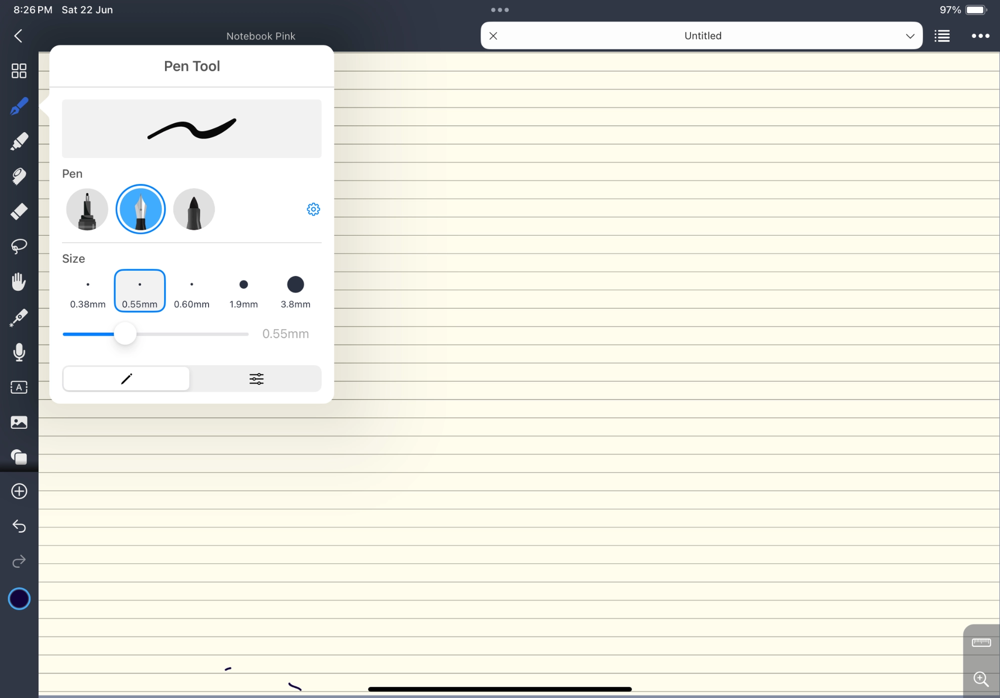

# Tablet interface

The target interface for the web app and the iPad app on a tablet-sized
screen. The four mockups below are the reference for layout, controls and
visual style. They are illustrations: the handwriting, names, counts and dates
in them are sample content, and the app is Math Notes. Phone layouts are not
specified. Where the mockups leave something open, GoodNotes and Noteful
are the reference for look and interaction.

## Screens

### Library

- **Sidebar**, always visible: the app name; Library, Recent,
  Pinned, Trash; a Tags list with a color and a count per tag, and
  **+** to add a tag; Settings at the bottom.
- **Main pane**: title "Library" and a one-line description; **New Notebook**
  (secondary) and **New Note** (primary) buttons; a search field; a filter
  menu ("All Notebooks"); a sort menu ("Last Modified"); a grid/list toggle.
- **Notebook cards** in a grid: a cloth-bound volume in its cover color,
  with the first handwritten page set into the cloth and the title on a
  printed paper label; under it the title, the note count, "Modified …",
  tag chips, and a **⋯** menu.
- **Detail pane** for the selected notebook: a large thumbnail, title, note
  count, modified time, tag chips with **+**, **Notes** and **Info** tabs, a
  note search field, and the note list (thumbnail, title, a one-line
  summary, modified time), ending with **New Note in <notebook>**.

### New Notebook

- **Cancel** at the top left, **Create** (primary) at the top right.
- Fields: Notebook Title; Description (optional, 500-character counter);
  Paper Style (Dot, Graph, Blank, Ruled, each with a preview tile); Tags
  (removable chips and "Add a tag…"); Location (a folder menu, "You can move
  this notebook later").
- **Preview** of the cover. A cover is a preview of the notebook's first
  page, here and on every card.
- The sheet sizes to its content. Escape and **Cancel** close it; when a
  field holds input, they ask before they discard it.

### New Note

- **Cancel**; title "New Note in <notebook>"; the target notebook's
  thumbnail with **Change Notebook**.
- Fields: Title; Paper Style (Dot, Grid, Lined, Plain, Graph); Tags; Starting
  Template (Blank Note, Theorem / Proof, Grid Sketch, Lecture Notes) with a
  one-line description of the selected template.
- A large live preview of the first page with the paper and template.
- **Save as template**, a bordered button under the starting templates,
  reveals a name field for the new template.
- **Save as draft** and **Create** (primary) at the bottom right. Escape and
  **Cancel** behave as in New Notebook.

### Editor

The mockup shows the page and the tabs. Noteful is the reference for the
toolbar and the tool popovers:

- **Top bar**: back to the library; the note title; **Open note**; the save
  status as secondary text. Labeled pull-down menus at the right. Each menu
  holds the actions of one object:
  - **Pages** (the current page and the page sequence): page overview; go to
    page; select page; clear page;
    paper for new pages (style, size, orientation); bookmarks and add
    bookmark; layers. Delete page is the last group, alone.
  - **Add page**: insert before the current page, insert after it, or append
    at the end. Each choice names its position before it runs.
  - **View** (the layout of the pages): fit width or height; vertical
    scroll, horizontal scroll, or two-page layout; split view.
  - **⋯** (the document): save; share and export PDF; compare conflicting versions, shown only
    when a sync client left a conflict copy of the note;
    close the note; Settings.
  Navigation between pages belongs to scrolling, swipe, and the page
  counter, not to menu rows.
- **Tabs**: a tab strip under the top bar while two or more notes are open,
  one tab per note with a close button. The active tab is marked by label
  color and selected semantics.
- **Settings sheet**, from ⋯ and from the library's Settings: draw with
  finger; follow links; show the tab strip; one switch per toolbar tool; in
  the library, the notes folder.
- **Page context menu** (long press or secondary click on the page): paste
  at that page; save to clippings.
- **Delete page** shows a toast with **Undo**.
- **Toolbar**: a floating vertical rail: a rounded panel with the floating
  shadow, inset 8 px from the left and top edges of the canvas. The canvas
  and the desk continue behind and around it. At zoom 1 the desk margin on
  the left of the page clears the rail, so the rail covers no writing; a
  zoomed or panned page passes under it. Icons without text labels, in separated groups: the tools (pen,
  marker, highlighter, eraser, lasso); the inserters (text, image, insert
  space, drawing mode, clippings); history (undo, redo); and one dot showing
  the current color. Each target is 44 × 44 pt with 8 pt between targets;
  between groups, the separator line sits in that gap. All targets fit a
  720 px high window. The rail is as tall as its content and scrolls
  vertically when its content is taller than the canvas.
- **Tool popover**: a tap on the selected tool opens its popover. The
  popover edits the settings of that tool only and never changes the tool.
  - Pen, marker, and highlighter: a stroke sample drawn by the engine; five
    size presets and a size slider; an **Advanced** tab with opacity;
    **Save** keeps the current settings as a saved pen. Each tool has one
    brush: the pen draws with pressure, the marker with a constant width.
  - Eraser: stroke, partial, or ruled.
  - Lasso: freehand, rectangle, oval, or ruled.
- **Colors**: the current-color dot opens the color popover. It holds the
  swatches, the saved pens, and **+**. A swatch sets the color of the
  current pen or highlighter, or recolors the lasso selection when there is
  one. A tap on the selected swatch opens a touch color picker (an HSV
  wheel) that edits that swatch. **+** edits the list of visible swatches.
- **Saved pens**: as in Write, a saved pen is a shortcut in the color
  popover that restores its tool (pen, marker, or highlighter) with its
  size, color, and opacity. It is not a new tool kind.
- **Undo and redo**: a tap undoes or redoes one step. A drag from the undo
  button turns a rewind dial around the button, as in Write
  (`ButtonDragDial` in `syncscribble/touchwidgets.cpp`): each dial step
  undoes or redoes one edit.
- **Page** area: the canvas under the top bar, behind the rail. Fit width
  keeps the current scroll position.

## Pages in the editor

- Pages have a 6 pt desk-colored gap between them. Each page is a sheet with
  a shadow on the desk color. In the default view a page fills the canvas
  width less a desk margin on each side; the left margin also clears the
  rail.
- One finger pans the pages. Two fingers pinch to zoom. Pen input draws.
- Flutter with Cupertino owns the complete web GUI and its input, focus,
  navigation, and controls. UIKit owns the independent iPad GUI.
  The [adopted framework decision](../reports/Web%20interface%20framework%20selection.md)
  defines the shared-core boundary.
- The notebook surface preserves framework-owned fling, edge resistance,
  rebound, and pinch navigation. On iPad, `UIScrollView` and MJRefresh 3.7.9
  `MJRefreshBackFooter` provide navigation and bottom pull. On web, Flutter
  owns the combined interaction. A held-ready release issues one add-page
  command; the notebook supplies the new page and template. Ordinary scrolling
  never adds a page. #56 verifies pen, finger, pinch, and release together.
- Ink cannot land outside a page. On pen-up, the parts of the stroke outside
  its page are removed (Noteful's behavior); a stroke entirely outside is
  removed.

## Visual style

Both hosts use complete iOS-style controls: SwiftUI and UIKit on the iPad,
Flutter Cupertino on the web. Their behavior belongs to the
components identified in [ARCHITECTURE.md](../ARCHITECTURE.md#component-ownership).
Apply the colors below through each framework's theme. Math Notes supplies
product layout and theme values.

The theme is "Bound volumes" from [Visual direction](../reports/Visual%20direction.md):
the library is a shelf of cloth-bound volumes, and the editor is an open
volume on a reading desk.

| Token | Hex | Role |
| --- | --- | --- |
| board | `#DADDD5` | The desk, the bars, and the library panels |
| leaf | `#EEF0EA` | The rail, menus, popovers, sheets, and the selected sidebar row |
| ink | `#1C2430` | Text, icons, and primary buttons |
| graphite | `#555D67` | Secondary text |
| ribbon | `#9E2A2B` | The current selection only: the active tool, the selected sidebar row's icon, the chosen swatch; also destructive actions |
| paper | `#FBFAF6` | The page and text fields |

Covers take buckram colors: navy `#24324A`, oxblood `#5B2328`, forest
`#2F4A3A`, and ochre `#A87B2C`. Nothing on the chrome is brighter than the
page. Menus are leaf; a hairline rule separates their groups, and items
within a group have no rules. Every text color meets 4.5:1 contrast on its
surface.

Elevation has two levels: floating controls (the rail, popovers, menus) and
modals (sheets, dialogs). Each level has one ink-tinted shadow. A modal dims
what is behind it with one ink scrim; a dialog also blurs it. A sheet does
not blur, so the page beside it stays legible.

Type: Alegreya Sans for the interface, at 14, 16, 18, 24, and 32 pt in
weights 400 and 800; Alegreya, its serif partner, for the library heading
and the titles on cover labels; Noto Sans for text on the page. The
interface uses the named roles of the theme. Labels use sentence case and
are left aligned.

## Relation to the current model

| Mockup | Current model ([FORMAT.md](../FORMAT.md), [FEATURES.md](../FEATURES.md)) |
| --- | --- |
| Paper Style, Starting Template (backgrounds) | Built-in templates: blank, lined-*, grid-*, dotted (#21) |
| Pen, highlighter, saved pens, color palette | Tool settings and saved pens in `.pens.json` (#25); Google Ink brush geometry in the current engine |
| Eraser, Lasso, Drawing mode | #23, #24, [TikZ drawing mode](tikz-drawing-mode.md) |
| Undo and redo, page overview | #22, #21 |
| Tabs of open notes | A tab per open note, as in GoodNotes and Noteful |
| Trash | `Notes/.trash/` |

The mockups add the following to FORMAT.md and FEATURES.md:

1. **A notebook contains notes, and this is the directory structure.** A
   mockup "notebook" is a folder; a mockup "note" is a FORMAT.md notebook
   directory.
2. **Metadata** (description, tags with colors, a one-line summary per note,
   drafts) lives in a JSON sidecar or in the app's internal database.
3. **Content templates** are saved settings: a named configuration of the
   new-note fields (paper, size, tags, and so on) that the user saves and
   reuses. The names in the mockup are sample content.
4. **Tabs** of open notes in the editor.
5. The Library search field filters by title. **Recent** sorts notes by
   modification time. **Pinned** filters by the saved pin flag.
